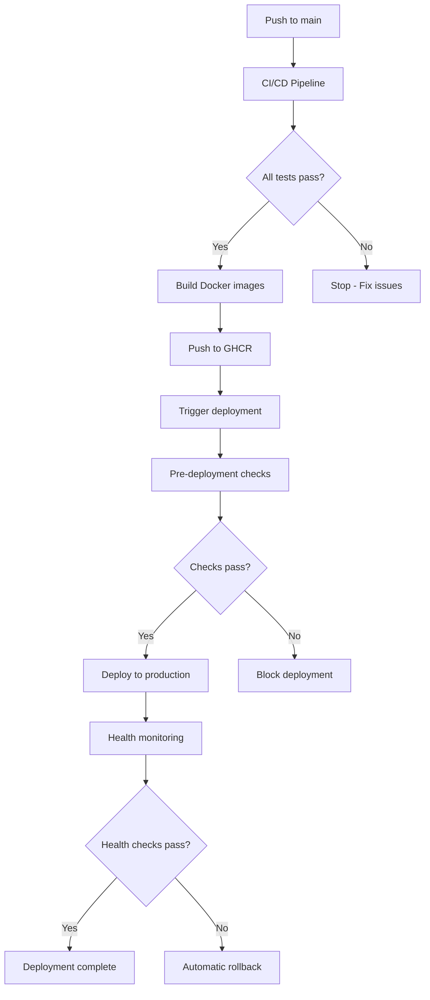

# Deployment Workflow Documentation

## Overview

The deployment workflow has been restructured to ensure safe, reliable deployments with automatic rollback capabilities.

## Workflow Dependencies

## Key Changes

### 1. Deployment Triggers
- **Removed**: Automatic deployment on push to main
- **Added**: Deployment only via workflow_dispatch or workflow_call
- **Added**: CI/CD workflow must complete successfully before deployment

### 2. Validation Steps
- **Added**: Pre-deployment validation job
- **Added**: CI/CD status verification
- **Added**: Environment validation
- **Added**: Resource availability checks

### 3. Rollback Mechanisms
- **Added**: Automatic rollback on health check failures
- **Added**: Manual rollback workflow
- **Added**: Deployment backup creation
- **Added**: 5-minute post-deployment monitoring

### 4. Monitoring & Reporting
- **Added**: Real-time health monitoring
- **Added**: Deployment status tracking
- **Added**: Automatic issue creation for failures
- **Added**: Deployment summary generation

## Deployment Process

### 1. Automatic Deployment (via CI/CD)
1. Code pushed to main branch
2. CI/CD pipeline runs all tests
3. If successful, Docker images are built and pushed
4. CI/CD triggers deployment workflow
5. Deployment validates CI/CD success
6. Deployment proceeds with health monitoring

### 2. Manual Deployment
1. Navigate to Actions > Deploy to Production
2. Click "Run workflow"
3. Select branch (usually main)
4. Optionally set environment and approval requirement
5. Deployment runs with all safety checks

### 3. Emergency Rollback
1. Navigate to Actions > Rollback Deployment
2. Click "Run workflow"
3. Enter reason for rollback
4. Type "ROLLBACK" to confirm
5. Previous version is restored

## Configuration Files

- `.github/workflows/deploy.yml` - Main deployment workflow
- `.github/workflows/ci-cd.yml` - CI/CD pipeline that triggers deployment
- `.github/workflows/rollback.yml` - Emergency rollback workflow
- `.github/workflows/deployment-status.yml` - Status tracking and reporting
- `deployment/scripts/monitor-deployment.sh` - Post-deployment health monitoring
- `deployment/scripts/pre-deployment-checks.sh` - Pre-deployment validation
- `deployment/config/deployment.json` - Centralized deployment configuration

## Safety Features

1. **Dependency Chain**: Deployment requires successful CI/CD
2. **Health Monitoring**: 5-minute monitoring after deployment
3. **Automatic Rollback**: Triggers on consecutive health failures
4. **Manual Rollback**: Available for emergency situations
5. **Deployment Backup**: Previous configuration saved before each deployment
6. **Status Tracking**: Real-time deployment status updates

## Monitoring

### Health Endpoints Monitored
- `/api/health` - Basic health check
- `/api/docs` - API documentation availability
- `/api/auth/status` - Authentication service status

### Monitoring Parameters
- Duration: 5 minutes
- Check interval: 30 seconds
- Error threshold: 3 consecutive failures
- Success rate threshold: 95%

## Troubleshooting

### Deployment Blocked
1. Check CI/CD workflow status
2. Review pre-deployment check results
3. Ensure no active deployments running
4. Verify Git repository is clean

### Health Check Failures
1. Check application logs: `ssh ubuntu@server "docker logs awareness-backend-1"`
2. Verify database connectivity
3. Check Redis service status
4. Review nginx configuration

### Rollback Issues
1. Ensure backup exists: `ssh ubuntu@server "ls -la /opt/awareness/*.backup"`
2. Check Docker service status
3. Verify previous images are available
4. Manual intervention may be required

## Best Practices

1. **Always** wait for CI/CD to complete before manual deployment
2. **Monitor** deployment logs during the process
3. **Test** in staging environment first (when available)
4. **Document** any manual interventions in deployment issues
5. **Review** monitoring logs after deployment completes

## Future Improvements

1. Add staging environment deployment
2. Implement blue-green deployment strategy
3. Add more comprehensive health checks
4. Integrate with monitoring services (Datadog, New Relic)
5. Add deployment approval workflow for production